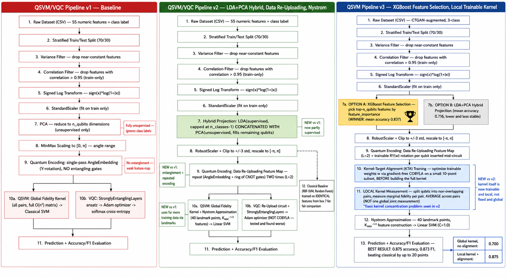

# Week 4 — QSVM/VQC Quantum ML for Malware Family Classification

Assigned scope was Day 22–28. Work done extends beyond the assigned scope with **Version 3** (located in [`bonus_version3_local_kernel_xgboost/`](./bonus_version3_local_kernel_xgboost/)), achieving the overall best result of the project: **0.875 accuracy** (beating classical baselines by up to 20 points).

---

## 📐 Architecture Evolution Overview (v1 $\rightarrow$ v2 $\rightarrow$ v3)

The diagram above details the step-by-step evolution of our Quantum Machine Learning pipelines across three iterations:

---

### 🔴 Pipeline v1 — Baseline (Unsupervised & Weak Encoding)
- **Data Preprocessing**:
  1. Raw Dataset (CSV) — 55 numeric features + class label
  2. Stratified Train/Test Split (70/30)
  3. Variance Filter (drop near-constant features)
  4. Correlation Filter (drop features with $r > 0.95$, fit on train-only)
  5. Signed Log Transform ($x \mapsto \text{sign}(x) \cdot \log(1 + |x|)$)
  6. `StandardScaler` (fit on train-only)
  7. **Dimensionality Reduction**: Unsupervised PCA to $n_{\text{qubits}}$ dimensions (*Fully unsupervised — ignores class labels*).
  8. `MinMaxScaler` to $[0, \pi]$.
- **Quantum Encoding**:
  - Single-pass `AngleEmbedding` (Y-rotations only) with **NO entangling gates** (*Weak feature map without entanglement*).
- **Quantum Models**:
  - **10a. QSVM**: Global Fidelity Kernel (computes full $O(n^2)$ Gram matrix) $\rightarrow$ Classical SVM.
  - **10b. VQC**: `StronglyEntanglingLayers` ansatz $\rightarrow$ Adam optimizer $\rightarrow$ Softmax Cross-Entropy loss.
- **Key Finding**: Classical baselines (RBF-SVM, Random Forest) beat quantum models by 8–17 points due to unsupervised PCA and non-entangled feature encoding.

---

### 🟢 Pipeline v2 — LDA+PCA Hybrid, Data Re-Uploading & Nyström Approximation
- **Key Innovations vs v1**:
  1. **Hybrid Projection (Box 7)**: Combines supervised **LDA** (capped at $n_{\text{classes}} - 1$) with unsupervised **PCA** to fill remaining qubit slots. (*Now partly supervised*).
  2. **Data Re-Uploading Feature Map (Box 9)**: Repeats `AngleEmbedding` + CNOT ring entangling gates twice ($L=2$). (*Introduces quantum entanglement & deeper feature map*).
  3. **Nyström Approximation (Box 10a)**: Uses 40 landmark points to construct $K_{MM}^{-1/2}$ explicit quantum feature vectors for a linear SVM. (*Allows scaling to far more training samples efficiently*).
  4. **Scaling**: `RobustScaler` + clipping to $\pm 3\,\sigma$, rescaled to $[-\pi, \pi]$.
- **Classical Baseline Comparison**: Classical models (RBF-SVM, Random Forest) trained on identical Box 7 features for fair comparison.
- **Results**: Rebuilt models closed and reversed the classical gap on SMOTE (QSVM 67.5% vs Classical 45–62.5%). However, at higher qubit counts, global fidelity measurements suffered from **kernel concentration** (exponential decay of inner products).

---

### 🔵 Pipeline v3 — XGBoost Feature Selection & Local Trainable Kernel (Best Result: 0.875)
- **Key Innovations vs v2**:
  1. **Feature Selection (Box 7a vs 7b)**:
     - **Option A (Winner 🏆)**: Supervised **XGBoost Feature Importance** selecting top-$n_{\text{qubits}}$ features directly (**Mean Accuracy: 0.837**).
     - **Option B**: LDA+PCA Hybrid Projection (**Mean Accuracy: 0.716**, lower & less stable).
  2. **Trainable Circuit Mid-Layers (Box 9 & 10)**:
     - Data Re-Uploading Feature Map ($L=2$) with trainable $RY(w)$ rotation parameters per qubit inserted mid-circuit.
     - **Kernel-Target Alignment (KTA) Training**: Optimizes weights $w$ via gradient-free **COBYLA** on a small 10-point subset *before* computing the full kernel matrix.
  3. **Local Kernel Measurement (Box 11)**:
     - Splits qubits into non-overlapping pairs, measures marginal fidelity per pair, and averages across pairs (*instead of one global joint measurement*).
     - **Fixes the kernel concentration problem** seen in v2.
  4. **Nyström Feature Map Construction (Box 12)**:
     - 40 landmark points $\rightarrow$ $K_{MM}^{-1/2}$ feature mapping $\rightarrow$ Linear SVM ($C=1.0$).
- **Performance Comparison & Ablation**:
  | Model / Architecture | Accuracy | F1 Score |
  | :--- | :---: | :---: |
  | Global Kernel, No Alignment (v2) | `0.700` | - |
  | **Local Kernel + Alignment (v3)** | **`0.875`** | **`0.873`** |
- **Conclusion**: Local kernel measurement + KTA alignment outperformed classical models on CTGAN data by up to **20 percentage points**.

---

## 📁 Folder Structure & Subdirectories

- **[`bonus_version3_local_kernel_xgboost/`](./bonus_version3_local_kernel_xgboost/)**: Version 3 pipeline implementation (local trainable kernel, XGBoost feature selection, KTA training script, ablation studies, and full technical report).
- **[`day22_ctgan_confirmation/`](./day22_ctgan_confirmation/)**: Traced and confirmed the 87% classical baseline accuracy (RandomForest on full CTGAN retrain data).
- **[`day23_version1_smote_qsvm_vqc/`](./day23_version1_smote_qsvm_vqc/)**: Version 1 baseline pipeline, QSVM + VQC on SMOTE data ($n=200, n=1000$).
- **[`day24-25_capacity_sweep/`](./day24-25_capacity_sweep/)**: Qubit capacity sweep analysis ($q=4$ vs $q=12$) demonstrating output-variance drop (3.4x) without accuracy gain.
- **[`day26-27_version2_hybrid_pipeline/`](./day26-27_version2_hybrid_pipeline/)**: Version 2 pipeline (LDA+PCA hybrid, data re-uploading, Nyström kernel) and comprehensive 27-config three-way dataset comparison (SMOTE vs CTGAN vs Original).
- **[`day28_writeup/`](./day28_writeup/)**: Final technical report, comprehensive Markdown summary tables, and full Jupyter notebooks.
- **[`uploaded_source_files_and_datasets/`](./uploaded_source_files_and_datasets/)**: Complete raw dataset CSVs (`MalMem2022_SMOTE.csv`, `malmem_ctgan__1_.csv`, `malmem_original.csv`) and original uploaded scripts.

---

## 📝 Documented Notes & Logbooks
- **[`WEEK_NOTES.md`](./WEEK_NOTES.md)**: Day-by-day task completion log and blockers going into next week.
- **[`NOTION_NOTES.md`](./NOTION_NOTES.md)**: Raw research notes, mathematical insights, and literature adaptations.
